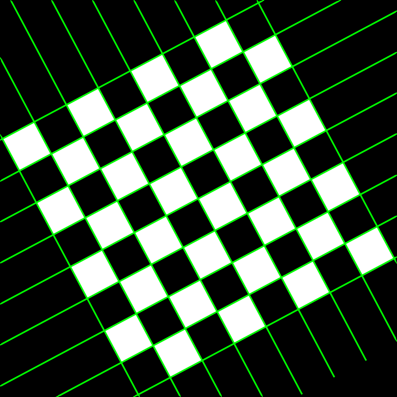
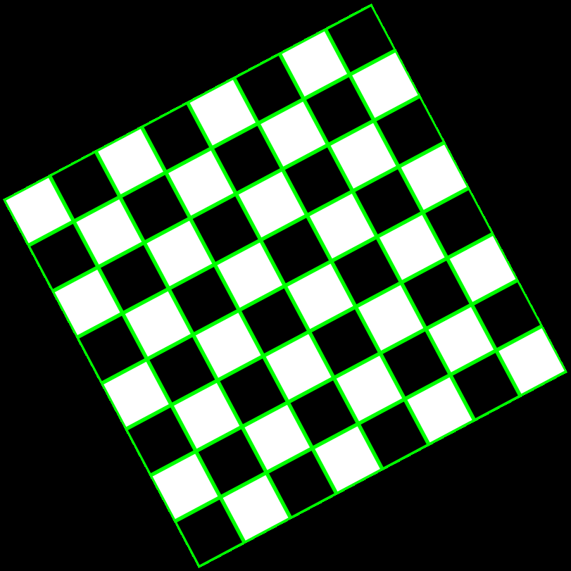

# Vision Programming Challenge

## Task
The task of the challenge is to detect the edge of the checkboard and 
highlight the detected edges in green color imposed in the image. 

## Concept and Implementation
This task is implemented using popular open source computer vision library
OpenCV in both c++ and python programming language. The edge and corners
are important features to detect simple objects, shapes and sometimes important
in localization and visual odometry.

### Step 1: Image Preprocessing
Image preprocessing is crucial step in any computer vision problem. The goal for
this step is to make image suitable for detection step. This step might include 
resizing the image, remove noise from the image, convert color of the image, and
thresholding the image.

1. Convert the color image to gray scale
2. Apply gaussian blur to the gray scale image reduce local noise
3. Apply Otsu's binarization as a threshold to blured image to reduce noise and make
binary mask
4. Apply Non-local mean denoising to binary image to reduce overall noise in the image


### Step 2: Edge Detection

1. First find edges in the image using Canny edge detection algorithm
2. Then apply hough tranformation on this edges to find straight lines in the image
3. Draw the lines.

### Step 3: Postprocessing
After converting the lines detected by hough transformation from hough space to cartesian
space, the end points of each line mapped out of image coordinates, so the extended lines
will be drawn as shown in picture below. This extra lines need to be trimmed from the
image for preferred output.



1. Segment the hough lines by angles using k-means clustering.
2. Find the intersections of the segmented lines.
3. Find the corner intersection points of the rectangle.
4. Draw binary contour using corner points on the empty image.
5. Use this binary mask to remove unnecessary area.

Final Output Image


## Installation

### C++

1. Install [OpenCV](https://docs.opencv.org/trunk/df/d65/tutorial_table_of_content_introduction.html)
2. Install [CMake](https://cmake.org/install/)
3. Open terminal and clone this project
4. Make directory build
```
cd ~/
git clone https://github.com/rajchovatiya31/vision_challenge.git
cd ~/vision_challenge
mkdir build && cd ./build
cmake ..
make
``` 
5. Run ./edge_detection_bin <image_path> from build directory

### Python

1. Open edge_detector.py located in <project_path>/src folder
2. Change image file path you want to try in main method at line 247.
3. Run python file in terminal or your favourite IDE. 

## Possible Improvements
1. Right now the postprocessing step is only available in python implementation.
2. The postprocessing step in a c++ has been attempted but it not working up to the mark,
hence it is commented out in the code.
3. Harris corner detection algorithm is also used to find intersection of the check
board. It might reduce the overall complexity to detect the rectangle corners but
could not be robust. 

## Reference
1. https://inside.mines.edu/~youyexie/paper/ICMV2017ppt.pdf
2. https://opencv-python-tutroals.readthedocs.io/en/latest/py_tutorials/py_tutorials.html
